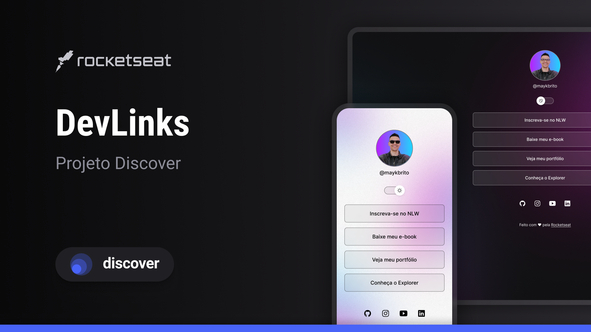

<h1 align="center"> Site Links </h1>

Projeto desenvolvido no curso Discover da Rocketseat.

  <a href="#-tecnologias">Tecnologias</a>&nbsp;&nbsp;&nbsp;|&nbsp;&nbsp;&nbsp;
  <a href="#-projeto">Projeto</a>&nbsp;&nbsp;&nbsp;|&nbsp;&nbsp;&nbsp;
  <a href="#-layout">Layout</a>&nbsp;&nbsp;&nbsp;|&nbsp;&nbsp;&nbsp;
  <a href="#memo-licença">Licença</a>

  

 

## 🚀 Tecnologias

Esse projeto foi desenvolvido com as seguintes tecnologias:

- HTML e CSS
- JavaScript
- Git e Github
- Figma

## 💻 Projeto

O site links é um agregador de links para usar como cartão de visitas online.

Nele pude aprimorar os conhecimentos sobre HTML e CSS, aprendendo a estruturar estilizar de maneira organizada os projetos em HTML.

## 🔖 Layout

Você pode visualizar o layout do projeto através [DESSE LINK](<https://www.figma.com/design/Fcn2XhbqIc54JFSpdQW7oN/DevLinks-%E2%80%A2-Projeto-Discover-(Community)?node-id=10-620&t=vbpVlFXzYNP3lOQ7-1>). É necessário ter conta no [Figma](https://figma.com) para acessá-lo.

## :memo: Licença

Esse projeto está sob a licença MIT.

---

Feito com ♥ by Rocketseat :wave: [Participe da nossa comunidade!](https://discord.gg/rocketseat)
